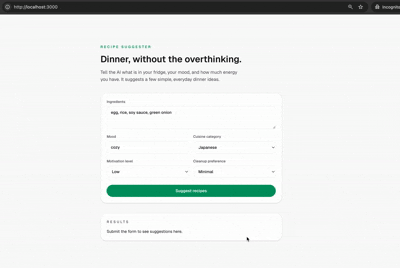

# 🍳 Recipe Suggester

This is a small project created while learning how to use AI in product development,
with a particular focus on **designing effective prompts for OpenAI**.

The idea came from a simple daily problem:

> “I don’t want to think about what to cook for dinner.”

By sending information such as:

- ingredients in your fridge
- your motivation level for cooking
- the type of cuisine you’re in the mood for

the AI suggests a few dinner ideas.

Rather than focusing on UI or complex features,
this project is mainly an exploration of:

- how to structure inputs for AI
- how prompt wording affects the quality of suggestions
- how AI-generated output can be integrated into a simple user flow

---

## このプロジェクトについて

AIを使ったプロダクト開発の学習として取り組んでいる小さなプロジェクトです。  
特に **OpenAI向けのプロンプト設計・入力設計** にフォーカスしています。

「晩ごはんのメニューを考えたくない…」  
という、とても日常的な悩みから生まれました。

冷蔵庫にある材料や、その日のやる気、料理の系統などの情報を送ると、  
AIがいくつか晩ごはんの候補を提案してくれます。

UIや機能の完成度よりも、

- どんな情報をどう渡すとAIがうまく提案できるか
- プロンプトの書き方によって出力がどう変わるか
- AIの出力をどうユーザー体験に組み込むか

といった点を試行錯誤することを目的としています。
